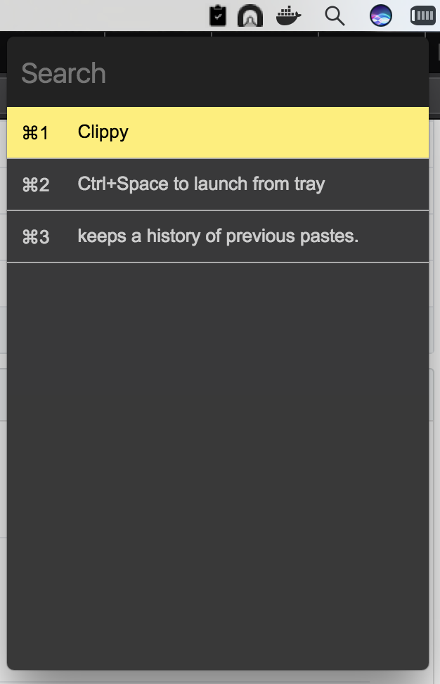

## Clippy

keeps a history of previous pastes. shows clipboard history in last used first

Build
-------
- npm install
- npm run build

Usage
-------
- Ctrl+Space to launch from tray
- Escape or Ctrl + Space to close
- Navigation with arrow keys
- Ctrl/Cmd + number to copy directly
- or, navigate to and press enter to copy
- Right Click to Quit

Downloads
------------
- [MacOsx](https://github.com/ikouchiha47/clippy/releases/download/v1.2.0/clippy-1.2.0.dmg)
- [Linux](https://github.com/ikouchiha47/clippy/releases/download/v1.2.0/clippy-1.2.0-x86_64.AppImage)
- [Windows](https://github.com/ikouchiha47/clippy/releases/download/v1.2.0/clippy-setup-1.2.0.exe)

